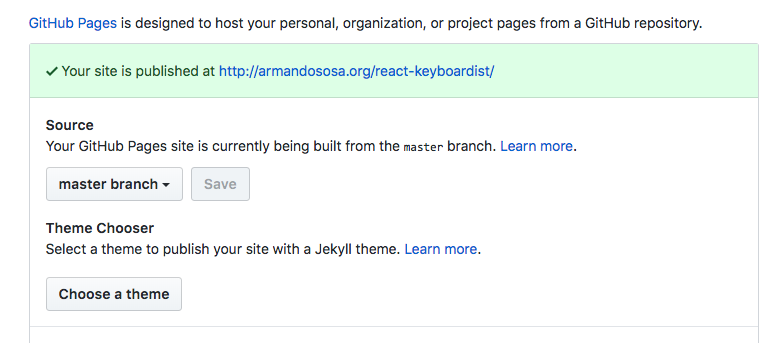

Is it weird that GitHub is quickly becoming my favorite hosting platform? I've been putting things online for a while now, but the truth is that I have never enjoyed it. Getting a server up and going feels like a big hassle and as a result I almost always refrained from doing passion projects.

Well, no more.

Full disclaimer: I know that if you want to build a fully-featured backend application GitGub Pages is not going to be enough. But I hope this guide is helpful for people doing content projects or static single-page applications.

## Why GitHub Pages

There are great static hosting companies like [Netlify](https://www.netlify.com/) or [Surge](https://surge.sh). And there's also Zeit's [Now](https://zeit.co/now), which does way more than just static hosting. Also, let's remember that you can even use an S3 bucket to host static html on a custom domain.

While trying to decide for one those options, a friend asked me why I haven't considered to use GitHub Pages. I honestly hadn't think about it. For starters, I thought using [Jekyll](https://jekyllrb.com/) was a requirement and --for no good reason-- I just don't like Jekyll. After [I found that to be false](https://help.github.com/articles/using-a-static-site-generator-other-than-jekyll/), and since I was already using Git and GitHub for version-control and development purposes it was just minutes to have my project online.

It was an eye-opening moment. And I wondered what else I can use it for?

## Hosting a Gatsby blog

I already wrote [about my experience setting up this blog with Gatsby](https://armandososa.org/2018/5/25/gatsby/) but I saved the recipe for the hosting part for this post. It's actually quite simple, thanks to a [npm package called gh-pages](https://www.npmjs.com/package/gh-pages).

The official [instructions are pretty simple](https://www.gatsbyjs.org/docs/how-gatsby-works-with-github-pages/) so there's no need for me to duplicate them here. Just remember, if [you're using custom domains](https://help.github.com/articles/using-a-custom-domain-with-github-pages/) to save your CNAME file, not in the root of your project, but inside the `static` folder. Otherwise, your custom domain will stop working after every deploy.

In my experience, I wanted my domain `armandososa.org` to be the _anchor_ for all my current and future projects. So I set up my Gatsby blog as my [User Site](https://help.github.com/articles/user-organization-and-project-pages/#user-and-organization-pages-sites) with my domain poiting to it. This way, other repository projects automatically become subpaths for this host. For example, my [keyboardist](https://github.com/soska/react-keyboardist) repo, automatically becomes available under [armandososa.org/react-keyboardist](https://armandososa.org/react-keyboardist) which I find pretty neat.

## Hosting a Create React App project

[Create React App](https://github.com/facebook/create-react-app) is Facebook's official zero-configuration React Development tool and it's jsut great. I happened to start a big project just months before CRA was released and I went back and ditched my whole home-made configuration and just used CRA default configuration instead. It just works&trade;.

Chances are that, if you're creating a React app for your boss or for a big client, you'll put in a Docker container or whatever kids do these days. For small apps, side projects or just demos I think putting them in Github Pages is perfectly adequate.

To do just that you'll have to install our helpful [gh-pages](https://www.npmjs.com/package/gh-pages) npm package.

```
$ npm install gh-pages
```

And setup a `deploy` script in your `package.json`, telling `gh-pages` where to fidn the compiled output.

```json
"scripts":{
  "deploy":"gh-pages -d build"
}
```

If you add a `predeploy` script, it will be run before deploy. That's helpful if you don't want to forget to build your app first.

```json
"scripts":{
  "predeploy":"npm run build",
  "deploy":"gh-pages -d build"
}
```

And if you need a `CNAME` file for your custom domain, you'll have to put it in inside the `public` folder, along the favicon and other static files. CRA's `build` script will copy the whole contents of this folder into the `build` folder when compiling your app.

## Just show me the Readme

Sometimes you just want a quick public website for your Open Source project and you don't have time to create a Gatsby blog or a React app. Or maybe you do have the time but choose to spend it watching The Office on Netflix and that's cool. The point is that you don't have to.

If you already have a well-crafted `README.md` (and you should), all you need to do is go to your repository settings and select `master branch` as the source of your GitHub Pages and GitHub will use it to build your page. I like the default theme, but you can select a different one.



Hot tip: If you want to add images to spice up your `README`, you can add them to your repo. For example, I like having an `assets` folder because I saw someone else naming it that.

```markdown

```

---

So these are three ways that I've been using GitHub Pages to remove friction from my development process. This way I can actually ship stuff instead of just having tons of unreleased side projects in my hard disk.

What did I miss? [Let me know on Twitter](https://twitter.com/soska) or send me an e-mail to arm.sosa[at]gmail.com.
